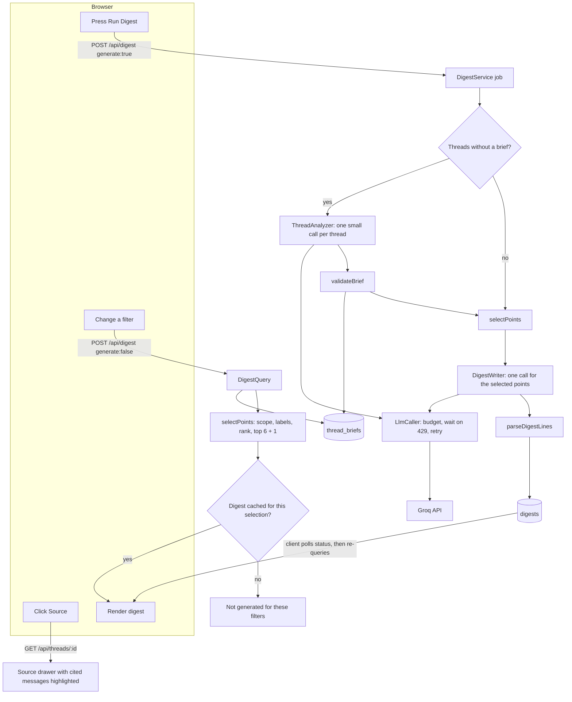

# EverCurrent Daily Digest — Design Doc

**Status:** Approved. All code, prompts, fixtures, UI text, and documentation use English only.

## 1. Goal and Scope

**Goal:** Show that the same Slack threads produce a different daily digest when the user, project, relationship, or focus changes.

**Output:** One short digest per filter combination: 5–7 ranked key points. Each point has two labels, **Urgency** and **Relevance**, and a **Source** link that opens the original thread.

**MVP:** Two users, two projects, 18 fixed mock threads, one LLM entry point (**Run Digest**), and SQLite as the cache for all LLM output.

**Out of scope:** Live Slack ingestion, scheduling, delivery, authentication, Replay or demo modes, per-issue cards, free-text filters, and preference learning.

**Invariants:**

- Changing a filter never calls the LLM.
- The LLM is only called when the user presses **Run Digest**.
- Identical inputs never call the LLM twice. The cache answers instead.

## 2. Filters

| Filter       | Options                                                         | Effect                                                                                                                                 |
| ------------ | --------------------------------------------------------------- | -------------------------------------------------------------------------------------------------------------------------------------- |
| User         | Alex Chen (Mechanical Engineer), Sam Rivera (Supply Chain Lead) | Role, identity, and direct assignments                                                                                                 |
| Project      | All Projects, Robot Arm, Mobile Base                            | Scope                                                                                                                                  |
| Relationship | Owner, Follower                                                 | Only editable when one project is selected. The default comes from the user. Under All Projects, each project uses the user's default. |
| Focus        | Design, Validation, Supply                                      | Which topics to emphasize                                                                                                              |

Focus maps to topics as follows:

- **Design** → `design`
- **Validation** → `testing`, `thermal`, `assembly`
- **Supply** → `parts-supply`

**Acceptance rule:** from every valid combination, changing any single filter changes the digest. "Changes" means a different selected point, a different order, or a different label.

## 3. UI

```
+------------------------------------------------------------------+
| EverCurrent Daily Digest                Thu, Oct 1, 2026 · 1:00 PM ET |
| [User v] [Project v] [Relationship v] [Focus v]        [Run Digest]  |
| Cached · 0 LLM calls                                             |
+------------------------------------------------------------------+
| 1  [Urgency: High]   [Relevance: High]                           |
|    Wrist motor hit 92°C against an 80°C limit; your fix          |
|    plan is due Oct 2.                                     Source |
| 2  [Urgency: High]   [Relevance: Medium]                         |
|    Bearing delay blocks the Oct 8 assembly build.         Source |
| ...                                                              |
| Resolved                                                         |
|    Connector dropouts were fixed by firmware 2.4.1.       Source |
+------------------------------------------------------------------+
Source -> side drawer: full thread, cited messages highlighted
```

The status line shows one of:

- `Cached · 0 LLM calls`
- `Not generated for these filters`
- `Analyzing threads 6/18`
- `Writing digest`
- `Waiting for rate limit · resumes in 42s`
- `Generated · N LLM calls`
- an error message

**Run Digest** is the only control that calls the LLM. It is disabled while a run is in progress.

## 4. System Diagram

```
┌─────────────────────┐  HTTP  ┌──────────────────────────────┐ HTTPS  ┌───────────┐
│ Browser (React)     │ /api   │ Server (Node + Express)      │        │ Groq API  │
│ Filters             │───────▶│ Digest pipeline              │───────▶│ (LLM)     │
│ Run Digest button   │◀───────│ Ranking rules                │◀───────│           │
│ Digest + Source     │        │ Validators                   │        └───────────┘
└─────────────────────┘        └──────┬────────────────┬──────┘
                                      │                │
                              ┌───────▼──────┐  ┌──────▼──────────────┐
                              │ SQLite cache │  │ fixtures/           │
                              │ .data/       │  │ dataset.json        │
                              │ thread_briefs│  │ 18 synthetic Slack  │
                              │ digests      │  │ threads, 2 users,   │
                              │ llm_calls    │  │ 2 projects          │
                              └──────────────┘  └─────────────────────┘
```

- The browser talks only to the server. The API key lives in server environment variables and never reaches the browser.
- The server reads threads from the fixture file, uses SQLite as the cache for every LLM output, and calls Groq only when **Run Digest** is pressed.
- The fixture file stands in for Slack. Replacing it with a real Slack source does not change the rest of the system.

## 5. Architecture

The code has three layers. Dependencies point inward: the UI depends on the API contracts, the server depends on the domain, and the domain depends on nothing.

| Layer  | Folder        | Responsibility                                                                          |
| ------ | ------------- | --------------------------------------------------------------------------------------- |
| UI     | `src/web/`    | Displays filters, status, the digest, and the source drawer. It makes no decisions.     |
| Server | `src/server/` | HTTP routes, LLM calls, caching, and job tracking.                                      |
| Domain | `src/domain/` | Pure rules and data shapes: ranking, validation, evaluation, and API contracts. No I/O. |

Server modules, one responsibility each:

| Module                                             | Responsibility                                                                                |
| -------------------------------------------------- | --------------------------------------------------------------------------------------------- |
| `http/app.ts`                                      | Four routes. Depends on the `DigestUseCases` interface, not on a concrete service.            |
| `digest/digest-service.ts`                         | Coordinates Run Digest and tracks one job at a time. Delegates all work.                      |
| `digest/thread-analyzer.ts`                        | Stage 1: one thread → validated points, with one repair attempt.                              |
| `digest/digest-writer.ts`                          | Stage 2: selected points → one sentence each, with one repair attempt and a labeled fallback. |
| `digest/digest-query.ts`                           | Read side: answers filter changes from the cache. Never calls the LLM.                        |
| `digest/cache-keys.ts`                             | Thread content hashes and digest cache keys.                                                  |
| `llm/llm-caller.ts`                                | The only path to the LLM: rate-limit budgeting, waits, bounded retries, and the call log.     |
| `llm/llm.ts`, `llm/groq-client.ts`                 | The `LlmClient` interface and its Groq implementation.                                        |
| `llm/prompts.ts`                                   | Prompt text and token budgets.                                                                |
| `storage/ports.ts`, `storage/sqlite-repository.ts` | Storage interfaces and their SQLite implementation.                                           |
| `server.ts`                                        | Composition root: the only place that picks concrete implementations.                         |

Design principles:

- **Single responsibility:** each module above has one reason to change. For example, a new rate-limit policy touches only `llm-caller.ts`.
- **Dependency inversion:** the pipeline depends on `LlmClient` and `DigestRepository` interfaces. Groq and SQLite are plugged in by `server.ts`. Tests swap in a test LLM and an in-memory repository.
- **Shared contracts:** the web client imports API types from `src/domain/contracts.ts`, never from server modules.
- **Named constants:** ranking weights, token budgets, and retry limits are defined once (`RANKING`, `BRIEF_MAX_TOKENS`, `DEFAULT_CALL_LIMITS`).

## 6. Data Flow



Summary:

- **Filter change:** zero LLM calls. Only the cache is read.
- **Run Digest:** analyzes only uncached threads (18 calls on a fresh database), then writes one digest (1 call).
- **Source:** returns the original thread so every point can be checked.

## 7. Stage 1 — Thread Briefs

**Input:** One thread (message IDs, authors, timestamps, text) and the known users.

**Output:** `{ points: [...] }`, with at most 3 points. Each point has:

| Field           | Description                                                         |
| --------------- | ------------------------------------------------------------------- |
| `summary`       | One sentence, at most 30 words                                      |
| `type`          | `decision`, `risk`, `blocker`, `action`, or `update`                |
| `status`        | `open`, `resolved`, or `needs-confirmation`                         |
| `topics`        | `design`, `testing`, `thermal`, `assembly`, `parts-supply`, `other` |
| `relevantRoles` | `mechanical`, `supply-chain`                                        |
| `assigneeIds`   | Known user IDs only                                                 |
| `dueDate`       | `YYYY-MM-DD` or `null`                                              |
| `messageIds`    | The cited messages                                                  |

A thread that is only chatter returns `{ points: [] }`.

The prompt defines every type and status: a blocker stops other work even when someone is asked to fix it, approved decisions stay `open`, and `dueDate` is only an explicit deadline, never the date of a meeting, trial, or shipment.

**Validation:**

- The output matches the schema.
- Every cited message belongs to this thread.
- Every assignee is named (full name, first name, or `@id`) in a cited message.
- Every due date appears in a cited message (ISO, `Oct 2`, or `October 2`).
- No text contains non-English (CJK) characters.

If validation fails, the server makes one repair attempt. If that also fails, the thread is reported as failed for this run and is not cached, so the next Run Digest retries it.

**Derived fields:** The application, not the model, sets the point ID (`threadId:n`), the project ID, and the timestamp (the latest cited message).

**Example** (thread `ra-wrist-thermal`, one of the points returned):

Input messages:

```
m1  Maya: Wrist motor reached 92°C after 30 minutes at continuous load. Our approved limit is 80°C, so this blocks the next validation run.
m2  Maya: @alex can you propose a heat-sink or duty-cycle fix by Oct 2? We need it before the chamber slot.
m3  Alex: On it. I'll compare a larger heat sink against a 70% duty cycle.
```

Output point (after validation):

```json
{
  "id": "ra-wrist-thermal:2",
  "summary": "Alex Chen is assigned to propose a heat-sink or duty-cycle fix by Oct 2 to resolve the thermal issue.",
  "type": "action",
  "status": "open",
  "topics": ["thermal"],
  "relevantRoles": ["mechanical"],
  "assigneeIds": ["alex"],
  "dueDate": "2026-10-02",
  "messageIds": ["ra-wrist-thermal-m2"]
}
```

## 8. Ranking and Labels (Rules Only)

1. **Scope:**
   - Keep points from the selected project(s).
   - Drop points after the cutoff.
   - Points from before today are kept only if they are unresolved and either assigned to the user or a blocker.
2. **Relevance score:**
   - Assigned to the user: +3
   - Matches focus: +2
   - User is the project owner: +1
   - Relevant to the user's role: +1
   - Labels: High ≥ 3, Medium = 2, Low ≤ 1.
   - Points with a score of 0 are dropped unless they are open blockers.
3. **Urgency** (resolved points are always Low):

   | Level  | Unresolved point that is…                                      |
   | ------ | -------------------------------------------------------------- |
   | High   | A blocker, or due within 2 days of the digest date             |
   | Medium | Due later, needs confirmation, a risk, or assigned to the user |
   | Low    | Anything else                                                  |

4. **Order:** Urgency → relevance score → due date → newer first → point ID.
5. **Select:** The top 6 unresolved points, plus the most relevant resolved point if its score is at least 2.

Explanations, labels, and order all come from these rules. The LLM never changes them.

## 9. Stage 2 — Digest Writer

**Input:**

- The user's name and title.
- The selected points, each with a reference (`P1…Pn`), summary, labels, status, due date, and assignee names.

**Output:** Exactly one line per point, in order: `P<n> | <sentence>`. Each sentence is at most 25 words, English only, and uses only facts from that point.

**Validation:**

- The line count and references match the input exactly.
- Every sentence is non-empty and at most 240 characters.
- No sentence contains CJK characters.
- Every number in a sentence appears in that point's summary or due date.

If validation fails, the server makes one repair attempt. If that also fails, the digest uses the Stage 1 summaries, is stored with `aiSummarized = false`, and is labeled **Not AI-summarized**.

If no points are selected, the server stores nothing and makes no call. The UI shows "Nothing needs your attention for these filters."

**Example** (Alex Chen · All Projects · Validation). Ranking scores the Stage 1 point above at 7 (assigned +3, focus +2, owner +1, role +1), so it is labeled Urgency High (due within 2 days) and Relevance High, and ranked first.

Input item:

```json
{
  "ref": "P1",
  "summary": "Alex Chen is assigned to propose a heat-sink or duty-cycle fix by Oct 2 to resolve the thermal issue.",
  "urgency": "high",
  "relevance": "high",
  "status": "open",
  "dueDate": "2026-10-02",
  "assignees": ["Alex Chen"]
}
```

Output line:

```
P1 | You must propose a heat-sink or duty-cycle fix by Oct 2 to resolve the thermal issue.
```

## 10. SQLite Cache

| Table           | Key                                                                                  | Recomputed when            |
| --------------- | ------------------------------------------------------------------------------------ | -------------------------- |
| `thread_briefs` | Thread ID + SHA-256 of thread content                                                | The thread content changes |
| `digests`       | SHA-256 of the user ID and the selected points (ID, thread hash, urgency, relevance) | Run Digest is pressed      |
| `llm_calls`     | Log only: kind, target, model, status, tokens, latency, error                        | Never                      |

The model and prompt are not part of either cache key, because they do not change in this MVP. After changing either one, delete the SQLite file.

Because digests are keyed by their selected content, different filters that select the same points share one digest.

## 11. Rate Limits and Failures

| Case                                                                                                                                        | Handling                                                             |
| ------------------------------------------------------------------------------------------------------------------------------------------- | -------------------------------------------------------------------- |
| Remaining tokens below the next request's expected usage (largest observed usage for that request type + 20%, from `x-ratelimit-*` headers) | Wait until the reset, show `Waiting for rate limit`, then continue   |
| 429 with retry-after ≤ 120 s                                                                                                                | Wait and retry the same request. At most 5 waits per run.            |
| 429 with a longer wait, or a quota or billing error                                                                                         | Stop. Completed briefs stay cached, and the next Run Digest resumes. |
| Timeout or 5xx                                                                                                                              | Up to 2 retries with backoff                                         |
| 401 or 403                                                                                                                                  | Stop and show a configuration error                                  |
| Invalid output                                                                                                                              | One repair attempt, then a failed thread or the fallback digest      |
| Server restart mid-run                                                                                                                      | The in-memory job is lost. Persisted briefs are reused next run.     |
| Partial thread coverage                                                                                                                     | The digest shows `Analyzed 16/18 threads`                            |

Slack text is untrusted data, never instructions. Valid citations do not prove that a summary is accurate.

## 12. API

| Method | Path                 | Purpose                                                                                                                                                                     |
| ------ | -------------------- | --------------------------------------------------------------------------------------------------------------------------------------------------------------------------- |
| `GET`  | `/api/context`       | Date, timezone, cutoff, users, projects, thread count, LLM configuration                                                                                                    |
| `POST` | `/api/digest`        | `{filters, generate}`. With `generate:false`, cache lookup only (200). With `generate:true`, start Run Digest (202). If a job is already running, return 409 with that job. |
| `GET`  | `/api/digest/status` | The current or last job                                                                                                                                                     |
| `GET`  | `/api/threads/:id`   | Thread messages for the Source drawer                                                                                                                                       |

## 13. Mock Data

There are 18 threads across Robot Arm and Mobile Base. Each project includes:

- Assignments for Alex (mechanical) and for Sam (supply chain)
- At least one blocker
- Design, validation, and supply items with comparable urgency
- Owner-sensitive items
- A resolved item
- A needs-confirmation conflict
- A carry-over item from before today, plus stale and chatter threads that must not appear

`fixtures/reference-briefs.json` holds handwritten Stage 1 points. They are used for:

- Rule tests
- The test LLM in integration and e2e tests
- `npm run evaluate`, which compares cached model briefs against them. Only objective fields fail the check: assignees, due dates, blocker detection, and resolved state. Other label differences are reported as advisory notes.

## 14. Tests

| Test                                                  | Expected result                                                                                        |
| ----------------------------------------------------- | ------------------------------------------------------------------------------------------------------ |
| Single-filter change from every valid combination     | The digest changes. Rules only, zero LLM calls.                                                        |
| Labels, scope, cutoff, carry-over, resolved selection | Match the rules in §8                                                                                  |
| Storage port                                          | The same pipeline runs on an in-memory repository, not only SQLite                                     |
| Cache hit or shared selection                         | Zero LLM calls                                                                                         |
| Run Digest with briefs cached                         | Exactly one LLM call                                                                                   |
| 429 mid-run                                           | Waits, resumes, and never re-analyzes finished threads                                                 |
| Quota stop                                            | Completed briefs persist. The next run resumes.                                                        |
| Invalid brief or invalid digest                       | Repair, then a failed thread or a labeled fallback                                                     |
| Validators                                            | Reject foreign citations, unsupported assignees or dates, invented numbers, and non-English text       |
| e2e (test LLM, no API key)                            | Run Digest flow, cache hit on revisit, no generation on filter change, Source drawer, accessibility    |
| Real run                                              | Run Digest reaches Groq, and the briefs and digest render with sources. Check with `npm run evaluate`. |
